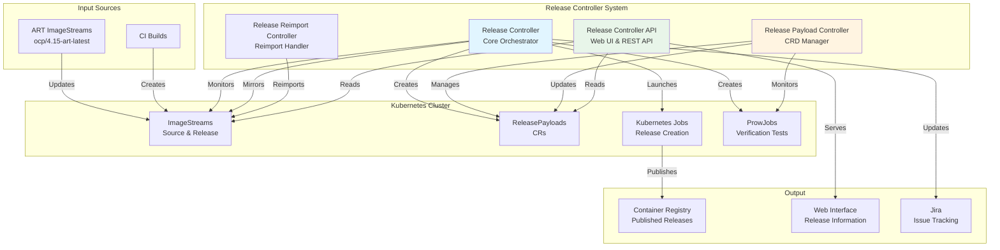
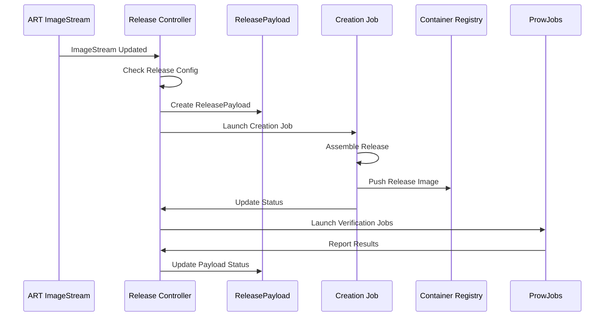
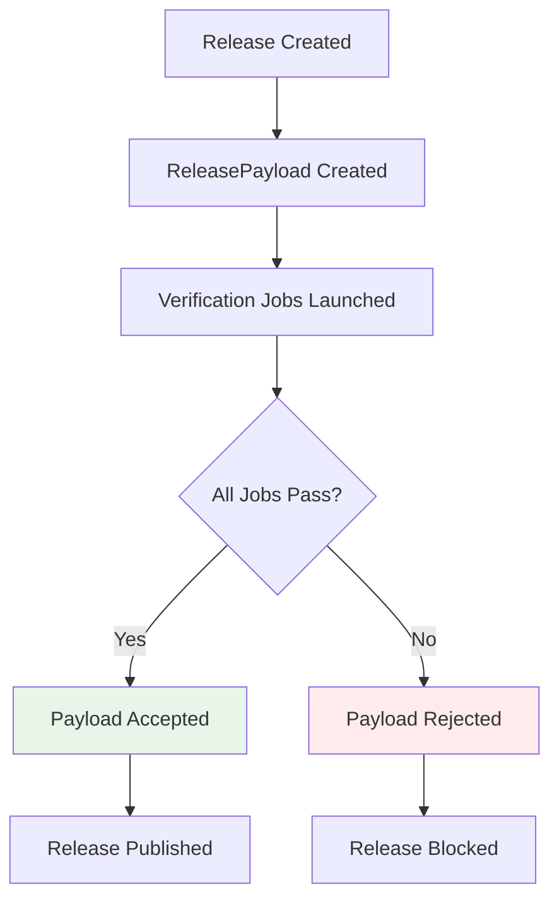
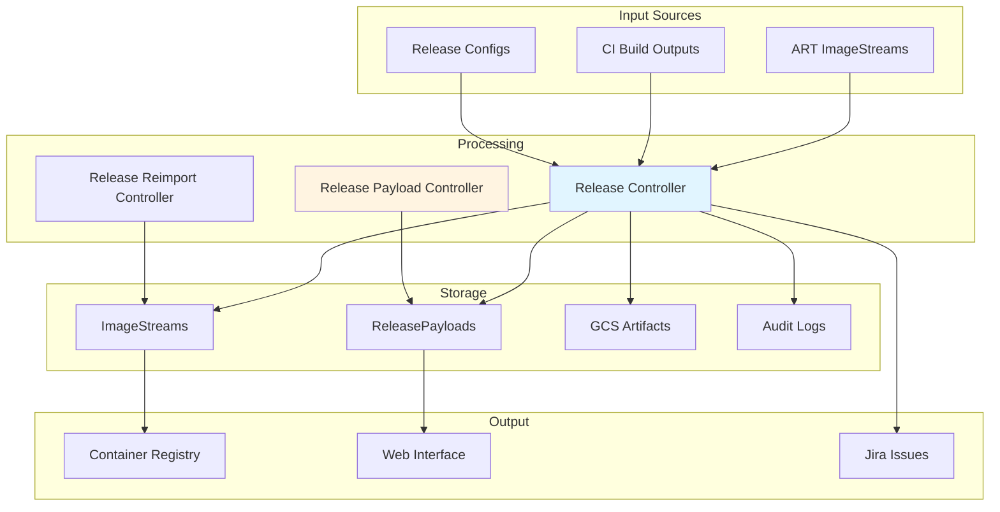
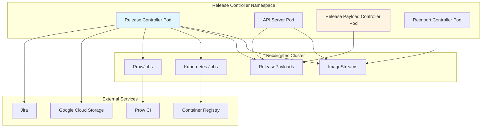
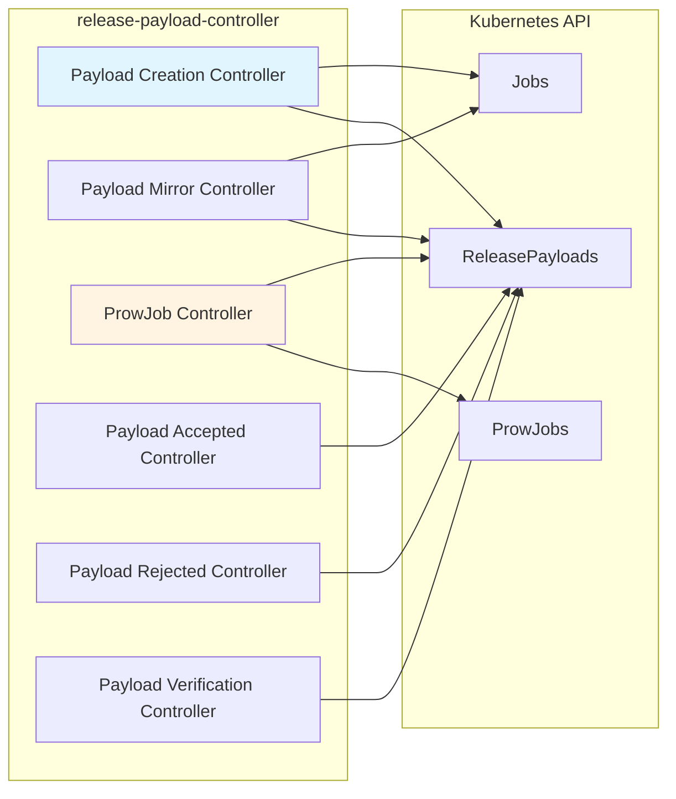
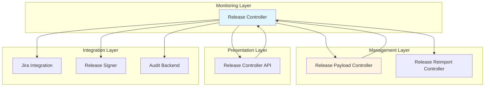
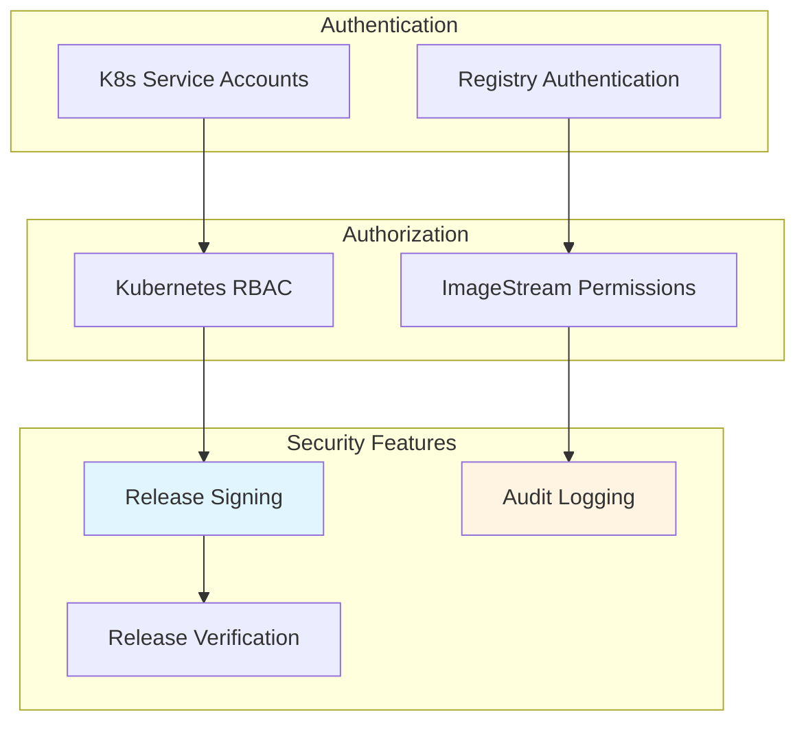
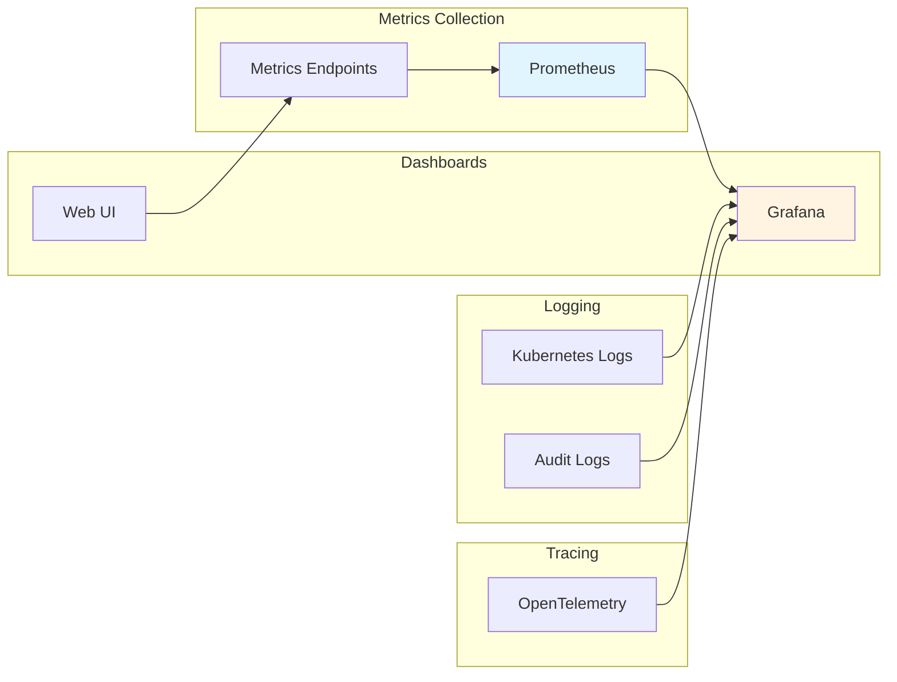

# Architecture Documentation

## System Architecture

Release Controller is a Kubernetes-native system that uses Custom Resources (ReleasePayloads) and ImageStreams to manage OpenShift releases. The architecture follows a controller pattern where multiple controllers work together to orchestrate the release process.

### High-Level Architecture Diagram

## Component Architecture

### Release Creation Flow

### Release Verification Flow

### Data Flow Diagram

## Deployment Architecture

### Production Deployment

### Controller Architecture

The release-payload-controller runs multiple sub-controllers:

## Component Interaction Diagram

## Key Design Patterns

### 1. Controller Pattern
All components follow the Kubernetes controller pattern:
- Watch for resource changes
- Reconcile desired state
- Handle errors and retries gracefully
- Update resource status

### 2. Custom Resources
ReleasePayload CRD represents release state:
- Tracks release creation progress
- Manages verification status
- Handles acceptance/rejection
- Stores release metadata

### 3. ImageStream-Based
Uses OpenShift ImageStreams for:
- Source image tracking
- Release image creation
- Image mirroring
- Point-in-time snapshots

### 4. Job-Based Execution
Release operations execute as Kubernetes Jobs:
- Release creation jobs
- Mirror jobs
- Verification jobs
- Independent and retryable

### 5. Event-Driven
System responds to events:
- ImageStream updates trigger releases
- Job completions trigger status updates
- ReleasePayload changes trigger actions

## Security Architecture

## Scalability Considerations

1. **Horizontal Scaling**: Controllers can be scaled horizontally
2. **Job Parallelization**: Multiple release jobs can run concurrently
3. **Caching**: ImageStream informers cache resource state
4. **Resource Management**: Garbage collection manages old releases
5. **Efficient API Usage**: Informers and watches for Kubernetes API

## Monitoring and Observability

