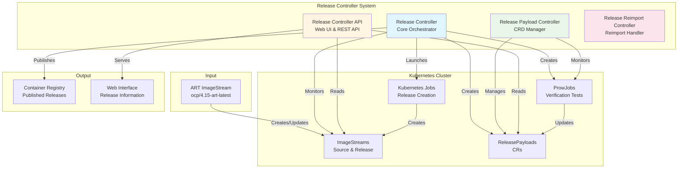
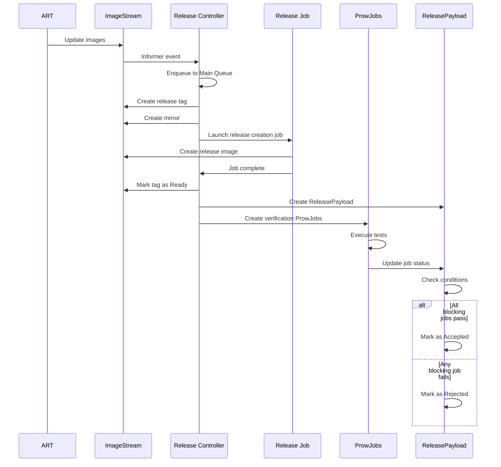

# Release Controller Architecture Diagrams

This document contains two architecture diagrams:

1. **Basic Overview**: High-level view of the system components
2. **Complete Architecture**: Detailed view of all components and their interactions

> **Note**: These diagrams use Mermaid syntax. If your viewer doesn't support Mermaid, see the ASCII alternatives below.

## Diagram 1: Basic Overview

This diagram provides a high-level overview of the release-controller system and its main components.



### ASCII Alternative (Basic Overview)

```text
┌─────────────────────────────────────────────────────────────────┐
│                         INPUT                                    │
│              ART ImageStream (ocp/4.15-art-latest)               │
└────────────────────────────┬────────────────────────────────────┘
                             │
                             ▼
┌─────────────────────────────────────────────────────────────────┐
│              RELEASE CONTROLLER SYSTEM                          │
│                                                                  │
│  ┌──────────────────┐  ┌──────────────────┐                    │
│  │ Release          │  │ Release          │                    │
│  │ Controller       │  │ Controller API   │                    │
│  │ (Core)           │  │ (Web UI)         │                    │
│  └────────┬─────────┘  └────────┬─────────┘                    │
│           │                      │                               │
│  ┌────────▼─────────┐  ┌─────────▼─────────┐                    │
│  │ Release Payload  │  │ Release Reimport  │                    │
│  │ Controller       │  │ Controller       │                    │
│  │ (CR Manager)    │  │ (Reimport)       │                    │
│  └──────────────────┘  └──────────────────┘                    │
└────────────────────────────┬────────────────────────────────────┘
                             │
                             ▼
┌─────────────────────────────────────────────────────────────────┐
│                    KUBERNETES CLUSTER                            │
│                                                                  │
│  ┌──────────────┐  ┌──────────────┐  ┌──────────────┐          │
│  │ ImageStreams │  │ Jobs         │  │ ProwJobs     │          │
│  │              │  │              │  │              │          │
│  └──────────────┘  └──────────────┘  └──────────────┘          │
│                                                                  │
│  ┌──────────────┐                                               │
│  │ Release      │                                               │
│  │ Payloads     │                                               │
│  │ (CRDs)       │                                               │
│  └──────────────┘                                               │
└────────────────────────────┬────────────────────────────────────┘
                             │
                             ▼
┌─────────────────────────────────────────────────────────────────┐
│                         OUTPUT                                   │
│                                                                  │
│  ┌──────────────┐              ┌──────────────┐                 │
│  │ Container    │              │ Web          │                 │
│  │ Registry     │              │ Interface    │                 │
│  └──────────────┘              └──────────────┘                 │
└─────────────────────────────────────────────────────────────────┘
```

## Diagram 2: Complete Architecture - Controller and Components

This detailed diagram shows all components, their interactions, and the complete flow of release processing.

```mermaid
graph TB
    subgraph "External Systems"
        ART[ART Pipeline<br/>Updates ImageStreams]
        JIRA[Jira<br/>Issue Tracking]
        GITHUB[GitHub<br/>PR Information]
        PROW[Prow<br/>Test Infrastructure]
    end
    
    subgraph "Release Controller Main"
        direction TB
        subgraph "Event Handlers"
            ISH[ImageStream Handler]
            JH[Job Handler]
            PJH[ProwJob Handler]
            RPH[ReleasePayload Handler]
        end
        
        subgraph "Work Queues"
            MAINQ[Main Queue<br/>Release Sync]
            GCQ[GC Queue<br/>Garbage Collection]
            AUDITQ[Audit Queue<br/>Release Auditing]
            JIRAQ[Jira Queue<br/>Issue Updates]
            LEGACYQ[Legacy Queue<br/>Migration]
        end
        
        subgraph "Core Sync Functions"
            SYNC[sync<br/>Main Release Logic]
            SYNCREL[syncRelease<br/>Create Release Tags]
            SYNCMIR[syncMirror<br/>Image Mirroring]
            SYNCVER[syncVerify<br/>Verification Jobs]
            SYNCGC[syncGC<br/>Garbage Collection]
            SYNCAUDIT[syncAudit<br/>Release Auditing]
            SYNCJIRA[syncJira<br/>Jira Updates]
        end
        
        subgraph "Supporting Components"
            RELEASEINFO[ReleaseInfo<br/>Release Metadata]
            GRAPH[UpgradeGraph<br/>Upgrade Paths]
            SIGNER[Signer<br/>Release Signing]
            CACHE[ImageCache<br/>Latest Images]
        end
    end
    
    subgraph "Release Controller API"
        direction TB
        HTTP[HTTP Server<br/>Port 8080]
        UI[Web UI Handler]
        REST[REST API Handlers]
        CANDIDATE[Candidate Handler]
        CHANGELOG[Changelog Handler]
        COMPARE[Compare Handler]
        GRAPHVIS[Graph Visualization]
    end
    
    subgraph "Release Payload Controller"
        direction TB
        subgraph "Payload Controllers"
            PCREATE[Payload Creation<br/>Controller]
            PVERIFY[Payload Verification<br/>Controller]
            PACCEPT[Payload Accepted<br/>Controller]
            PREJECT[Payload Rejected<br/>Controller]
            PMIRROR[Payload Mirror<br/>Controller]
        end
        
        subgraph "Job Controllers"
            JOBSTATE[Job State<br/>Controller]
            LEGACYJOB[Legacy Job Status<br/>Controller]
            RELEASECREATE[Release Creation Job<br/>Controller]
            RELEASEMIRROR[Release Mirror Job<br/>Controller]
        end
    end
    
    subgraph "Kubernetes Resources"
        direction TB
        subgraph "ImageStreams"
            SOURCEIS[Source ImageStream<br/>ocp/4.15-art-latest]
            RELEASEIS[Release ImageStream<br/>ocp/4.15]
            MIRRORIS[Mirror ImageStream<br/>ocp/4.15-mirror-xxx]
        end
        
        subgraph "Jobs"
            RELEASEJOB[Release Creation Job<br/>oc adm release new]
            ANALYSISJOB[Analysis Job]
            AGGREGATIONJOB[Aggregation Job]
        end
        
        subgraph "ProwJobs"
            BLOCKINGPJ[Blocking<br/>Verification Jobs]
            INFORMINGPJ[Informing<br/>Verification Jobs]
            UPGRADEPJ[Upgrade<br/>Test Jobs]
        end
        
        subgraph "CRs"
            RELEASEPAYLOAD[ReleasePayload<br/>Custom Resource]
        end
    end
    
    subgraph "Storage & Output"
        GCS[GCS Bucket<br/>Audit Logs]
        REGISTRY[Container Registry<br/>Published Releases]
        SECRETS[Kubernetes Secrets<br/>Upgrade Graph]
    end
    
    %% External to Controller
    ART -->|Updates| SOURCEIS
    SOURCEIS -->|Informer Event| ISH
    ISH -->|Enqueue| MAINQ
    
    %% Main Controller Flow
    MAINQ -->|Process| SYNC
    SYNC -->|Calls| SYNCREL
    SYNC -->|Calls| SYNCMIR
    SYNC -->|Calls| SYNCVER
    SYNC -->|Calls| SYNCGC
    
    SYNCREL -->|Creates| RELEASEIS
    SYNCREL -->|Creates Tag| RELEASEIS
    SYNCREL -->|Launches| RELEASEJOB
    
    SYNCMIR -->|Creates| MIRRORIS
    SYNCMIR -->|Mirrors Images| MIRRORIS
    
    SYNCVER -->|Reads Prow Config| PROW
    SYNCVER -->|Creates| BLOCKINGPJ
    SYNCVER -->|Creates| INFORMINGPJ
    SYNCVER -->|Creates| UPGRADEPJ
    
    RELEASEJOB -->|Completes| JH
    JH -->|Enqueue| MAINQ
    
    BLOCKINGPJ -->|Status Update| PJH
    PJH -->|Enqueue| MAINQ
    
    %% Release Payload Flow
    SYNCREL -->|Creates| RELEASEPAYLOAD
    RELEASEPAYLOAD -->|Informer Event| PCREATE
    PCREATE -->|Updates Conditions| RELEASEPAYLOAD
    
    BLOCKINGPJ -->|Status| PVERIFY
    INFORMINGPJ -->|Status| PVERIFY
    UPGRADEPJ -->|Status| PVERIFY
    PVERIFY -->|Updates| RELEASEPAYLOAD
    
    RELEASEPAYLOAD -->|Accepted| PACCEPT
    RELEASEPAYLOAD -->|Rejected| PREJECT
    
    RELEASEJOB -->|Status| RELEASECREATE
    RELEASECREATE -->|Updates| RELEASEPAYLOAD
    
    %% API Flow
    HTTP -->|Routes| UI
    HTTP -->|Routes| REST
    REST -->|Reads| SOURCEIS
    REST -->|Reads| RELEASEIS
    REST -->|Reads| RELEASEPAYLOAD
    REST -->|Calls| CANDIDATE
    REST -->|Calls| CHANGELOG
    REST -->|Calls| COMPARE
    REST -->|Calls| GRAPHVIS
    
    CHANGELOG -->|Uses| RELEASEINFO
    COMPARE -->|Uses| RELEASEINFO
    GRAPHVIS -->|Reads| GRAPH
    
    %% Supporting Components
    SYNC -->|Uses| RELEASEINFO
    RELEASEINFO -->|Executes| RELEASEJOB
    RELEASEINFO -->|Caches| CACHE
    CACHE -->|Gets Latest| SOURCEIS
    
    SYNC -->|Updates| GRAPH
    UPGRADEPJ -->|Results| GRAPH
    GRAPH -->|Stored In| SECRETS
    
    %% Audit Flow
    RELEASEIS -->|Tag Ready| AUDITQ
    AUDITQ -->|Process| SYNCAUDIT
    SYNCAUDIT -->|Launches| ANALYSISJOB
    SYNCAUDIT -->|Uses| SIGNER
    SYNCAUDIT -->|Writes| GCS
    
    %% Jira Flow
    RELEASEIS -->|Accepted| JIRAQ
    JIRAQ -->|Process| SYNCJIRA
    SYNCJIRA -->|Reads| GITHUB
    SYNCJIRA -->|Updates| JIRA
    
    %% Legacy Migration
    RELEASEIS -->|Old Tags| LEGACYQ
    LEGACYQ -->|Migrates| RELEASEPAYLOAD
    
    %% Garbage Collection
    GCQ -->|Process| SYNCGC
    SYNCGC -->|Deletes Old| RELEASEIS
    SYNCGC -->|Deletes Old| MIRRORIS
    
    %% Publishing
    PACCEPT -->|Publishes| REGISTRY
    
    style RC fill:#e1f5ff
    style API fill:#fff4e1
    style RPC fill:#e8f5e9
    style SYNC fill:#bbdefb
    style RELEASEPAYLOAD fill:#c8e6c9
    style PROW fill:#fff9c4
```



### ASCII Alternative (Complete Architecture - Simplified)

```text
┌─────────────────────────────────────────────────────────────────────┐
│                         EXTERNAL SYSTEMS                             │
│  ART Pipeline  │  Jira  │  GitHub  │  Prow                          │
└────────┬───────┴─────────┴──────────┴───────────┬───────────────────┘
         │                                        │
         │ Updates ImageStream                    │ Executes Tests
         ▼                                        │
┌─────────────────────────────────────────────────┴───────────────────┐
│                    RELEASE CONTROLLER MAIN                           │
│                                                                       │
│  ┌──────────────────────────────────────────────────────────────┐  │
│  │                    EVENT HANDLERS                              │  │
│  │  ImageStream │ Job │ ProwJob │ ReleasePayload                 │  │
│  └──────────────┬────────────────────────────────────────────────┘  │
│                 │                                                     │
│  ┌──────────────▼────────────────────────────────────────────────┐  │
│  │                    WORK QUEUES                                │  │
│  │  Main │ GC │ Audit │ Jira │ Legacy                            │  │
│  └──────────────┬────────────────────────────────────────────────┘  │
│                 │                                                     │
│  ┌──────────────▼────────────────────────────────────────────────┐  │
│  │              CORE SYNC FUNCTIONS                              │  │
│  │  sync │ syncRelease │ syncMirror │ syncVerify │ syncGC       │  │
│  └──────────────┬────────────────────────────────────────────────┘  │
│                 │                                                     │
│  ┌──────────────▼────────────────────────────────────────────────┐  │
│  │           SUPPORTING COMPONENTS                                │  │
│  │  ReleaseInfo │ UpgradeGraph │ Signer │ ImageCache            │  │
│  └──────────────────────────────────────────────────────────────┘  │
└────────────────────────────┬────────────────────────────────────────┘
                             │
         ┌───────────────────┴───────────────────┐
         │                                       │
         ▼                                       ▼
┌──────────────────────┐            ┌──────────────────────┐
│  RELEASE CONTROLLER  │            │  RELEASE PAYLOAD     │
│  API                 │            │  CONTROLLER          │
│                      │            │                      │
│  HTTP Server         │            │  Payload Controllers │
│  Web UI              │            │  Job Controllers     │
│  REST API            │            │                      │
└──────────────────────┘            └──────────────────────┘
         │                                       │
         └───────────────────┬───────────────────┘
                             │
                             ▼
┌─────────────────────────────────────────────────────────────────────┐
│                    KUBERNETES RESOURCES                              │
│                                                                       │
│  ImageStreams: Source │ Release │ Mirror                            │
│  Jobs: Release Creation │ Analysis │ Aggregation                     │
│  ProwJobs: Blocking │ Informing │ Upgrade                           │
│  CRDs: ReleasePayload                                               │
└────────────────────────────┬────────────────────────────────────────┘
                             │
                             ▼
┌─────────────────────────────────────────────────────────────────────┐
│                    STORAGE & OUTPUT                                  │
│  GCS (Audit Logs) │ Container Registry │ Kubernetes Secrets         │
└─────────────────────────────────────────────────────────────────────┘
```

## Component Details

### Release Controller Main Components

#### Event Handlers

- **ImageStream Handler**: Watches for changes to source ImageStreams via Kubernetes informers
- **Job Handler**: Monitors Kubernetes Job completion and triggers release processing
- **ProwJob Handler**: Tracks ProwJob status updates for verification tests
- **ReleasePayload Handler**: Responds to ReleasePayload changes and updates

#### Work Queues

- **Main Queue**: Processes release sync operations (rate-limited)
- **GC Queue**: Handles garbage collection of old releases
- **Audit Queue**: Manages release auditing (severely rate-limited: 5 per 2 seconds)
- **Jira Queue**: Updates Jira tickets for fixed issues
- **Legacy Queue**: Migrates old ImageStream-based results to ReleasePayloads

#### Sync Functions

- **sync()**: Main orchestration function that coordinates all release operations
- **syncRelease()**: Creates and manages release tags in ImageStreams
- **syncMirror()**: Creates point-in-time image mirrors to prevent pruning
- **syncVerify()**: Launches and monitors verification ProwJobs
- **syncGC()**: Removes old/unused releases and mirrors
- **syncAudit()**: Audits and signs releases, stores results in GCS
- **syncJira()**: Updates Jira tickets when releases fix issues

### Release Controller API Components

- **HTTP Server**: Main web server listening on port 8080
- **Web UI**: HTML interface for browsing releases, viewing graphs, and comparing releases
- **REST API**: JSON endpoints for programmatic access to release information
- **Candidate Handler**: Shows candidate releases ready for promotion
- **Changelog Handler**: Generates release changelogs from commit history
- **Compare Handler**: Compares two releases to show differences
- **Graph Visualization**: Displays upgrade paths between releases

### Release Payload Controller Components

#### Payload Controllers

- **Payload Creation**: Updates the payload creation conditions
- **Payload Verification**: Populates the initial ReleasePayload Status stanza
- **Payload Accepted**: Updates the payload accepted condition
- **Payload Rejected**: Updates the payload rejected condition
- **Payload Mirror**: Monitors release mirror/creation jobs and updates ReleasePayload conditions

#### Job Controllers

- **Job State**: Updates job states in ReleasePayloads based on job completion
- **Legacy Job Status**: Migrates old job status from ImageStream annotations to ReleasePayloads
- **Release Creation Job**: Tracks release image creation job status
- **Release Mirror Job**: Tracks mirror job status and completion

### Data Flow

#### 1. Release Creation Flow

```text
ART Updates ImageStream
  → Controller detects change (Informer)
  → Enqueues to Main Queue
  → sync() processes
  → syncMirror() creates mirror (Point-In-Time)
  → syncRelease() creates release tag
  → Launches release creation job
  → Job runs 'oc adm release new'
  → Release image created
  → Tag marked as Ready
  → ReleasePayload CR created
```

#### 2. Verification Flow

```text
Release image Ready
  → syncVerify() reads Prow config
  → Creates ProwJobs (blocking, informing, upgrade)
  → Prow executes jobs
  → Job status updates trigger ReleasePayload updates
  → All blocking jobs pass → ReleasePayload Accepted
  → Any blocking job fails → ReleasePayload Rejected
```

#### 3. Acceptance Flow

```text
All blocking jobs pass
  → ReleasePayload condition updated to Accepted
  → Payload Accepted Controller updates accepted condition
  → Release available for end users
```

#### 4. Auditing Flow

```text
Release tag Ready
  → Enqueued to Audit Queue (rate-limited)
  → syncAudit() processes
  → Launches analysis job
  → Signs release with GPG keyring
  → Stores audit logs in GCS
```

#### 5. API Access Flow

```text
User requests release info
  → HTTP Server receives request
  → Routes to appropriate handler
  → Handler reads ImageStreams/ReleasePayloads
  → Uses ReleaseInfo for metadata
  → Generates response (HTML/JSON)
  → Returns to user
```

## Key Interactions

### Between Controllers

- **Release Controller** creates ReleasePayload CRs when new releases are detected
- **Release Payload Controller** updates ReleasePayload conditions and status based on job results
- Both controllers monitor the same Kubernetes resources but handle different aspects
- Controllers use Kubernetes informers for efficient resource watching

### With External Systems

- **Prow**: Controller creates ProwJobs, Prow executes them and reports results
- **Jira**: Controller reads GitHub PRs to find fixed issues, updates Jira tickets to VERIFIED
- **Registry**: Controller publishes accepted releases to external container registries
- **GCS**: Controller stores audit logs and signed release metadata in Google Cloud Storage

### With Kubernetes

- **Informers**: Efficient resource watching with local caching
- **Work Queues**: Rate-limited processing to prevent overwhelming the cluster
- **Jobs**: Long-running operations (release creation, analysis)
- **CRDs**: Custom resource definitions for ReleasePayloads
- **Secrets**: Stores upgrade graph data persistently

## Sequence Diagram: Release Creation



## Architecture Decisions

### Why Multiple Controllers?

- **Separation of Concerns**: Each controller handles a specific aspect (core logic, API, CRD management)
- **Scalability**: Controllers can be scaled independently
- **Maintainability**: Easier to understand and modify individual components

### Why Multiple Kubeconfigs?

- **Security**: Different permissions for different operations
- **Isolation**: ProwJobs may need different cluster access than regular jobs
- **Flexibility**: Allows connecting to different clusters for different purposes

### Why Work Queues?

- **Rate Limiting**: Prevents overwhelming the cluster with too many operations
- **Retry Logic**: Failed operations can be retried with backoff
- **Prioritization**: Different queues for different priority operations

### Why ReleasePayloads?

- **Better Observability**: Structured status and conditions
- **Kubernetes Native**: Uses standard Kubernetes patterns
- **Extensibility**: Easy to add new fields and conditions
- **Migration Path**: Moving away from ImageStream annotations

## Performance Considerations

- **Informer Caching**: Reduces API server load by caching resources locally
- **Rate Limiting**: Prevents controller from overwhelming the cluster
- **Batch Processing**: Groups related operations together
- **Async Processing**: Non-blocking operations for better throughput

## Security Considerations

- **Multiple Kubeconfigs**: Least privilege access for different operations
- **Signing**: Releases are signed with GPG keyrings
- **Audit Logging**: All operations are logged for compliance
- **Image Verification**: Only verified releases are signed
